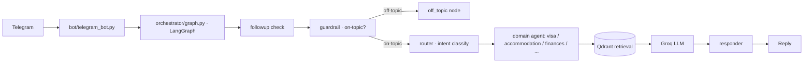

**Stack:** Python · LangGraph · LangChain · Qdrant · Groq · sentence-transformers (all-MiniLM-L6-v2) · python-telegram-bot

**Repo:** [github.com/PranavC225/early-companion](https://github.com/PranavC225/early-companion)

## Problem

Information for international students at LiU is fragmented across dozens of sources — visa rules, accommodation, finances, scholarships, insurance, arrival logistics. New students don't know where to look or who to ask.

## Approach

early-companion answers these questions conversationally in Telegram, routing each one to a domain expert grounded in retrieval over curated sources, rather than relying on one catch-all prompt:

- Answers questions across 7 domains: visa, accommodation, finances, scholarships, travel, insurance, arrival.
- Routes every message through an explicit LangGraph flow.
- A guardrail node gates off-topic messages before they reach an agent.
- Follow-up questions skip re-classification for faster multi-turn dialogue.
- Per-user conversational memory (last 10 turns; resets on restart).
- Retrieval-augmented answers grounded in a Qdrant vector store.

## Architecture

**Flow:** `followup` → `guardrail` → `router` → `responder` → END. Off-topic messages short-circuit to `off_topic`; follow-ups bypass the guardrail (`followup_router` → `responder`). Each domain agent extends `agents/base_agent.py` (a shared RAG chain: Qdrant retrieval → prompt → Groq LLM) and is loaded dynamically via `importlib`.

## Stack — and why

- **LangGraph** — explicit, stateful routing is easier to reason about and debug than one giant prompt.
- **Qdrant** (port 6333) — production-grade vector store.
- **Groq** — fast, free-tier LLM inference.
- **sentence-transformers** `all-MiniLM-L6-v2` — cheap, local embeddings.
- **python-telegram-bot** — Telegram interface.

## Results

*Demo GIF of a real conversation — coming soon.*

## What I learned

Why I split the guardrail from the router — gating "is this on-topic?" is a different decision from "which domain?", and separating them made both prompts simpler and more reliable.
