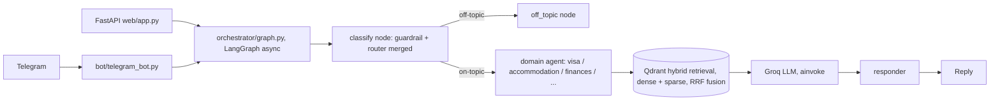

**Stack:** Python · LangGraph · LangChain · FastAPI · Qdrant (hybrid dense+sparse) · Groq · sentence-transformers (all-MiniLM-L6-v2) · fastembed (BM25) · python-telegram-bot · Docker · GCP Cloud Run

**Repo:** [github.com/PranavC225/early-companion](https://github.com/PranavC225/early-companion)

## Problem

Information for international students at LiU is fragmented across dozens of sources: visa rules, accommodation, finances, scholarships, insurance, arrival logistics. New students don't know where to look or who to ask.

## Approach

early-companion answers these questions conversationally, routing each one to a domain expert grounded in retrieval over curated sources, rather than relying on one catch-all prompt:

- Answers questions across 7 domains: visa, accommodation, finances, scholarships, travel, insurance, arrival.
- Routes every message through an explicit, fully async LangGraph flow.
- A single classify call gates off-topic messages and picks the domain agent in one LLM round trip, with conversation history passed in so follow-ups are handled in context.
- Hybrid retrieval: a dense (sentence-transformers) and a sparse (BM25 via fastembed) query run in parallel against Qdrant and are fused with Reciprocal Rank Fusion, so exact institutional terms (course codes, form names, office names) surface reliably alongside semantic matches.
- Answers cite their source URLs so students can check the original page.
- Per-user conversational memory (last 10 turns), persisted in SQLite across restarts.
- Two entry points, one pipeline: a FastAPI web UI and a Telegram bot both call the same async graph.
- Pytest suite, an eval harness scoring routing accuracy, retrieval recall and answer faithfulness, and a GitHub Actions CI pipeline running both on every push.

## Architecture

```mermaid
flowchart LR
  TG[Telegram] --> Bot[bot/telegram_bot.py]
  Web[FastAPI web/app.py] --> G
  Bot --> G[orchestrator/graph.py, LangGraph async]
  G --> C[classify node: guardrail + router merged]
  C -->|off-topic| OT[off_topic node]
  C -->|on-topic| A[domain agent: visa / accommodation / finances / ...]
  A --> Q[(Qdrant hybrid retrieval, dense + sparse, RRF fusion)]
  Q --> L[Groq LLM, ainvoke] --> Resp[responder] --> Reply
```

**Flow:** `classify` → `responder` (or `off_topic`) → END, every node `async def` and wired with `graph.ainvoke()`. Domain agents are resolved through an explicit `AGENT_REGISTRY` dict. The Telegram bot and the FastAPI web UI are two thin entry points over the same async pipeline.

## Why this stack

- **LangGraph:** explicit, stateful routing is easier to reason about and debug than one giant prompt.
- **Hybrid retrieval (Qdrant + fastembed):** dense-only search reliably missed queries built around exact institutional named entities; fusing a sparse BM25 query back in fixed that without giving up semantic matches.
- **FastAPI:** a small web UI is a faster demo path than a Telegram screen recording, and it reuses the same pipeline as the bot.
- **Groq:** fast, free-tier LLM inference.
- **python-telegram-bot:** keeps the original Telegram interface working alongside the web UI.
- **Docker + GCP Cloud Run:** the web UI is containerized and deployed against a Qdrant Cloud instance, with secrets in GCP Secret Manager.

## Results

A real conversation in Telegram. The bot opens with its seven domains, then answers a housing-queue question, a scholarships question and an accommodation question, each routed to the matching domain agent:

## What I learned

- Why I merged the guardrail back into the router: I split them first because "is this on-topic?" and "which domain?" felt like separate decisions worth separate prompts, but that meant three sequential LLM calls per message. Once both prompts were reliable on their own, merging them into one classify call cut per-message latency and token spend roughly 3x, with no accuracy loss.
- Scraper failures don't always look like failures: a JS-rendered source page can return 200 with an empty content div, so the scraper now checks for that explicitly instead of silently indexing nothing for that source.
