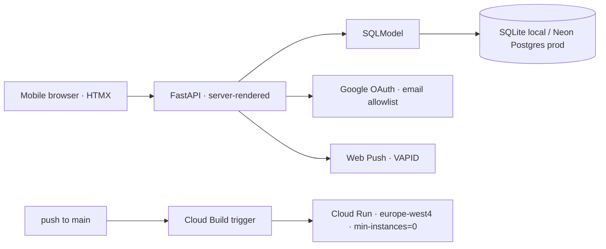

**Stack:** Python · FastAPI · HTMX · SQLModel · Google Cloud Run · Google OAuth · Web Push (VAPID)

**Repo:** [github.com/PranavC225/family_tasks](https://github.com/PranavC225/family_tasks)

## Problem

A dead-simple, phone-first shared task list with reliable reminders, without the overhead of a single-page app or the cost of a paid push service.

## Approach

- Server-rendered task management (create/assign/complete), optimized for mobile.
- Google OAuth login restricted to an email allowlist.
- Web Push notifications via VAPID; no Firebase/FCM.
- Database-agnostic: SQLModel over `DATABASE_URL` (SQLite locally, Neon Postgres in production).
- Auto-deploys on push to `main` via a Cloud Build trigger; secrets in GCP Secret Manager.

## Architecture

## Stack — and why

- **FastAPI + HTMX** — server-rendered, no SPA build step or client-state overhead.
- **SQLModel** — a single model layer that swaps databases via one env var.
- **Google Cloud Run** (europe-west4) — scale-to-zero.
- **Web Push / VAPID** — push notifications without a Firebase dependency.
- **Google OAuth** — auth gated to an email allowlist (`auth.py:auth_callback`).
- **GCP Secret Manager + Cloud Build** — secret storage and push-to-deploy CI/CD.

## Results

The live app is OAuth-gated to an email allowlist, so there's no public login to demo. Screenshots/GIF of the task flow are coming soon — see the architecture above for how it's built.

## What I learned

- **Web Push** — implementing VAPID directly instead of reaching for a Firebase/FCM dependency.
- **DB-agnostic from day one** — putting SQLModel behind `DATABASE_URL` meant SQLite locally and Postgres in prod with zero code change.
- **Scale-to-zero economics** — `min-instances=0` + Cloud Build trigger gives push-to-deploy at no idle cost.
