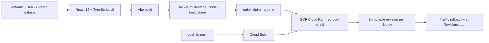

**Stack:** React 18 · TypeScript · Vite · TailwindCSS · Framer Motion · Docker (nginx) · GCP Cloud Run

**Repo:** [github.com/PranavC225/marvel-universe-movie-list](https://github.com/PranavC225/marvel-universe-movie-list)
**Live:** [marvel-web-71077891082.europe-north1.run.app](https://marvel-web-71077891082.europe-north1.run.app/)

## Problem

Built for the lapsed fan who stopped watching after *Avengers: Endgame* — there's no single place that lists every MCU title by Saga/Phase and hands you a ready-made path through everything released since, in either release order or in-universe chronology.

## Approach

- Every MCU title (*Iron Man* 2008 → upcoming Phase 6) grouped by Saga → Phase → Title in one curated dataset.
- Toggle between release order and in-universe-chronological order.
- Filter by type (movie/series), status, and character.
- "I stopped after Endgame" — one click marks the Infinity Saga watched and generates a catch-up path.
- Watch-path builder that steps through a chronological or character-specific watch order.
- Watch progress persisted in `localStorage`, with per-phase/per-saga progress bars.
- Respects OS-level `prefers-reduced-motion`.

## Architecture

## Stack — and why

- **React + Vite + TypeScript** — fast local iteration, typed dataset (`data/mcu.json`) as the single source of truth so adding a title never touches component code.
- **TailwindCSS + Framer Motion** — utility-first styling with animated transitions that respect `prefers-reduced-motion`.
- **No backend** — the whole app is static; all filtering/sorting/progress logic runs client-side against the curated JSON.
- **Docker multi-stage build (Node → nginx)** — the build stage compiles the SPA, the runtime stage is a minimal nginx image serving `dist/`.
- **GCP Cloud Run** — each push to `main` triggers a Cloud Build job that deploys a new immutable revision; git tags map 1:1 to revisions, so rollback is a traffic-routing change in the Cloud Run console, no redeploy needed.

## Results

Live at the link above — deployed and publicly reachable. `v1.0.0` shipped the full dataset, saga/phase navigation, both order-toggle modes, filtering, the watch-path builder, and the Endgame catch-up flow (see [CHANGELOG.md](https://github.com/PranavC225/marvel-universe-movie-list/blob/main/CHANGELOG.md)).

## What I learned

- **Immutable-revision deploys** — Cloud Run's per-push revision model makes rollback a traffic-routing decision instead of a redeploy, which changed how I think about tagging releases.
- **Data-driven UI** — keeping the entire catalog in one JSON file meant every feature (filtering, ordering, progress tracking) is a pure function over that data, with zero hardcoded titles in components.
- **Accessibility as a default, not an afterthought** — wiring `prefers-reduced-motion` through Framer Motion's `MotionConfig` from the start was near-zero cost.
