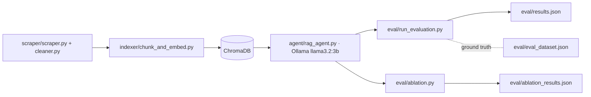

**Stack:** Python · LangChain · ChromaDB · Ollama (llama3.2:3b) · sentence-transformers (all-MiniLM-L6-v2) · BERTScore · ROUGE

**Repo:** [github.com/PranavC225/732A81_Text_Mining_Project](https://github.com/PranavC225/732A81_Text_Mining_Project)

## Problem

Most student RAG projects stop at "it answers questions." This one measures *how well* — built as coursework for the 732A81 Text Mining course at LiU, then extended further with Claude Code.

## Approach

A single RAG agent over LiU housing Q&A, plus an ablation harness sweeping chunking strategies and retrieval parameters and scoring every variant against a ground-truth QA set:

- Scrapes and cleans LiU housing content into a corpus.
- Indexes it into ChromaDB with configurable chunking.
- Answers questions via a local Ollama (`llama3.2:3b`) RAG agent.
- Scores answers against a ground-truth QA set (BERTScore + ROUGE).
- Runs an ablation sweep over chunking/retrieval params and records the results.

## Architecture

## Stack — and why

- **LangChain** — RAG orchestration.
- **ChromaDB** (port 8000) — vector store.
- **Ollama / llama3.2:3b** (port 11434, GPU) — local LLM, no API cost.
- **sentence-transformers** `all-MiniLM-L6-v2` — embeddings.
- **BERTScore + ROUGE** — answer-quality metrics, not just "it ran."

## Results

*Best vs. worst config on BERTScore/ROUGE-L, plus the most surprising finding from the sweep — table coming soon.*

## What I learned

Evaluating a RAG pipeline is harder than building one — and far more revealing.
