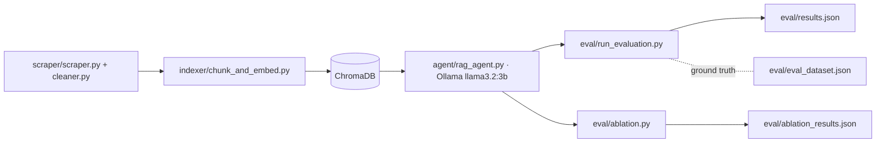

**Stack:** Python · LangChain · ChromaDB · Ollama (llama3.2:3b) · sentence-transformers (all-MiniLM-L6-v2) · BERTScore · ROUGE

**Repo:** [github.com/PranavC225/732A81_Text_Mining_Project](https://github.com/PranavC225/732A81_Text_Mining_Project)

## Problem

Most student RAG projects stop at "it answers questions." This one measures *how well* — built as coursework for the 732A81 Text Mining course at LiU, then extended further with Claude Code.

## Approach

A single RAG agent over LiU housing Q&A, plus an ablation harness sweeping chunking strategies and retrieval parameters and scoring every variant against a ground-truth QA set:

- Scrapes and cleans LiU housing content into a corpus.
- Indexes it into ChromaDB with configurable chunking.
- Answers questions via a local Ollama (`llama3.2:3b`) RAG agent.
- Scores answers against a ground-truth QA set (BERTScore + ROUGE).
- Runs an ablation sweep over chunking/retrieval params and records the results.

## Architecture

```mermaid
flowchart LR
  S[scraper/scraper.py + cleaner.py] --> I[indexer/chunk_and_embed.py]
  I --> C[(ChromaDB)]
  C --> A[agent/rag_agent.py · Ollama llama3.2:3b]
  A --> E[eval/run_evaluation.py] --> R[eval/results.json]
  E -.ground truth.- D[eval/eval_dataset.json]
  A --> AB[eval/ablation.py] --> AR[eval/ablation_results.json]
```

## Stack — and why

- **LangChain** — RAG orchestration.
- **ChromaDB** (port 8000) — vector store.
- **Ollama / llama3.2:3b** (port 11434, GPU) — local LLM, no API cost.
- **sentence-transformers** `all-MiniLM-L6-v2` — embeddings.
- **BERTScore + ROUGE** — answer-quality metrics, not just "it ran."

## Results

Four configurations, sweeping chunk size × overlap × retrieval depth, each scored against the same 45-question ground-truth set:

| Chunk | Overlap | top_k | Chunks indexed | ROUGE-1 | ROUGE-2 | ROUGE-L | BERTScore F1 |
|---|---|---|---|---|---|---|---|
| **500** | **80** | **5** | 112 | **0.4642** | **0.3039** | **0.4129** | **0.9088** |
| 250 | 40 | 8 | 240 | 0.4475 | 0.2897 | 0.3908 | 0.9047 |
| 250 | 40 | 5 | 240 | 0.4287 | 0.2730 | 0.3744 | 0.9036 |
| 500 | 80 | 8 | 112 | 0.4228 | 0.2856 | 0.3750 | 0.9017 |

**The surprising part: retrieving *more* made it worse.** Holding chunking fixed at 500/80 and raising `top_k` from 5 to 8 dropped every single metric — ROUGE-1 0.4642 → 0.4228, ROUGE-L 0.4129 → 0.3750, BERTScore 0.9088 → 0.9017. That is the one clean single-variable contrast in the sweep, and it cuts against the intuition that giving the model more context can only help. My reading is that the extra chunks dilute the prompt with near-miss passages the 3B model then has to arbitrate between.

At chunk=250 the same `top_k` bump went the other way (ROUGE-1 0.4287 → 0.4475), which hints that the quantity that matters is *total retrieved context* rather than `k` on its own — the two mid-budget configs came out ahead of both extremes on all four metrics. With four configs and one run, I'd treat that as an observation worth testing, not a finding.

*Caveats, stated plainly: 45 eval questions, a single run per config, one local model (llama3.2:3b), four configurations. The BERTScore spread across all four is 0.007 — small enough that I would not defend the tail of that ranking without more seeds.*

## What I learned

Evaluating a RAG pipeline is harder than building one — and far more revealing. The agent itself came together quickly; building something that could tell me whether a change actually helped took considerably longer, and that was the part that changed how I work.

The concrete lesson: "retrieve more" is not a free improvement. I had treated a higher `top_k` as a safe default, and at the chunk size I was actually using, the sweep contradicted that outright. On intuition alone I would have shipped the worse configuration and never known.

It also taught me to be careful about how much weight a small eval set can carry. A 0.007 BERTScore gap over 45 questions is not a mandate — it's a hypothesis, and saying so plainly is part of the job.
